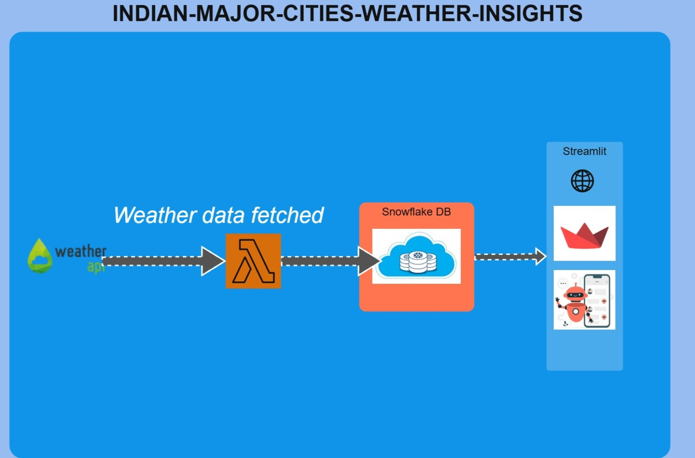

# AWS_Lambda_Hackathon

## Overview
This project provides a scalable, serverless weather insights dashboard for major Indian cities, leveraging AWS Lambda, Snowflake, and Streamlit. It fetches real-time weather data, stores it in a Snowflake data warehouse, and visualizes it interactively for end users.

## Architecture

- **Weather API**: External weather data is fetched periodically (e.g., hourly) from a third-party API.
- **AWS Lambda (ETL)**: A Lambda function (named `snowstream` in region `us-west-2`) is triggered to fetch, clean, and load weather data into Snowflake. The Streamlit app can trigger this Lambda function on demand.
- **Snowflake**: Stores all weather data in a structured table for historical and analytical queries.
- **Streamlit App**: Provides a web dashboard for querying and visualizing weather data by city/location, including temperature, humidity, wind speed, and trends over time.

## Features
- **Trigger Lambda from UI**: The dashboard button triggers the AWS Lambda function to fetch and push the latest data to Snowflake.
- **Secure Credentials**: All Snowflake and AWS credentials are managed via Streamlit secrets and session state.
- **Location-based Filtering**: Users can filter and visualize weather data by `LOCATION_NAME`.
- **Rich Visualizations**: Interactive charts for temperature, humidity, wind speed, and time trends using Plotly.
- **Recommendations**: AI-driven suggestions for improving air quality in Indian cities.

## File Structure
- `Home.py`: Main entry point, sets up navigation and app config.
- `pages/Architecture.py`: Shows the architecture diagram and explains the data flow.
- `pages/Realtime_Weather_Across_India.py`: Main dashboard for weather data, Lambda trigger, and visualizations.
- `src/`: Contains images and architecture diagram assets.

## How to Run
1. Install requirements: `pip install -r requirements.txt`
2. Set up your `secrets.toml` with Snowflake and AWS credentials.
3. Run the app: `streamlit run Home.py`

## Inspiration
This project was inspired by the need for real-time, scalable, and actionable weather insights for Indian cities, leveraging modern cloud and data technologies. The goal was to empower citizens, researchers, and policymakers with up-to-date weather and air quality data, and to demonstrate the power of serverless architectures for public good.

## What it does
- Fetches real-time weather  data for major Indian cities using external APIs.
- Triggers an AWS Lambda function to process and push the latest data into a Snowflake data warehouse.
- Provides a Streamlit dashboard for interactive visualization, filtering, and analysis of weather data by location.
- Offers AI-driven recommendations for improving air quality.

## How we built it
- **Backend:** AWS Lambda (Python) for ETL, triggered from the Streamlit UI.
- **Data Warehouse:** Snowflake for scalable, secure storage and analytics.
- **Frontend:** Streamlit for the dashboard, with Plotly for interactive charts.
- **Integration:** Secure credential management via Streamlit secrets and session state. All components are loosely coupled and cloud-native.

## Challenges we ran into
- Integrating secure, on-demand Lambda triggers from the Streamlit UI.
- Ensuring seamless data flow and schema consistency between Lambda, Snowflake, and the dashboard.
- Handling API rate limits and data quality issues from external weather sources.
- Making the dashboard both powerful and user-friendly for a wide audience.

## Accomplishments that we're proud of
- End-to-end automation: One-click data refresh from API to dashboard.
- Robust, scalable, and serverless architecture.
- Clean, interactive, and insightful visualizations for weather and AQI data.
- Collaboration between developers Darshan and Mahantesh to deliver a full-stack solution.

## What we learned
- Best practices for integrating AWS Lambda, Snowflake, and Streamlit.
- Secure handling of cloud credentials in a public-facing app.
- Building user-centric dashboards with advanced filtering and visualization.
- The importance of clear architecture and modular code for maintainability.

## What's next for Weather Forecast
- Add predictive analytics and machine learning for weather and AQI forecasting.
- Integrate more data sources (satellite, IoT sensors, etc.).
- Enable user alerts and notifications for severe weather or pollution events.
- Expand to cover more cities and regions, and support additional languages.
- Deploy as a managed SaaS solution for organizations and governments.

---
Developed with ❤️ by Darshan and Mahantesh.
